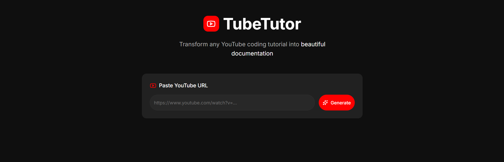

# YouTube Tutorial Generator 🎥✨

Transform any YouTube coding video into a professional, step-by-step written tutorial in seconds.



## 🚀 Features

- **AI-Powered Generation**: Uses Google's Gemini models to analyze transcripts and generate structured documentation.
- **Smart Model Fallback**: Automatically rotates between `gemini-2.5-flash`, `gemini-2.5-flash-lite`, `gemini-2.0-flash`, and `gemini-1.5-flash` to handle API quotas gracefully.
- **YouTube-Inspired UI**: Clean, dark-themed interface with familiar aesthetics.
- **Rich Markdown Support**: Full syntax highlighting for code blocks, styled inline code, and clean typography.
- **Pro PDF Export**: Download your tutorials as beautifully formatted PDFs with preserved syntax highlighting.
- **Live Preview**: See your tutorial generated in real-time.

## 🛠️ Tech Stack

- **Framework**: Next.js 15 (App Router)
- **Styling**: Tailwind CSS + Framer Motion
- **AI**: Google Generative AI SDK (Gemini)
- **PDF Generation**: jsPDF
- **Icons**: Lucide React

## 🚦 Getting Started

1. **Clone the repository**
   ```bash
   git clone https://github.com/codewithabdou/YouTube-Tutorial-Generator.git
   cd youtube-tutorial-generator
   ```

2. **Install dependencies**
   ```bash
   npm install
   ```

3. **Configure Environment**
   Create a `.env.local` file in the root directory and add your Gemini API key:
   ```env
   GEMINI_API_KEY=your_api_key_here
   ```
   > You can get a free API key from [Google AI Studio](https://makersuite.google.com/app/apikey).

4. **Run the development server**
   ```bash
   npm run dev
   ```

5. **Open the app**
   Visit [http://localhost:3000](http://localhost:3000) in your browser.

## 📝 Usage

1. Paste a YouTube video URL (must have captions/transcripts enabled).
2. Click **"Generate Tutorial"**.
3. Watch as the AI reconstructs the code and explanation.
4. Export as **Markdown** or **PDF** to save your tutorial.